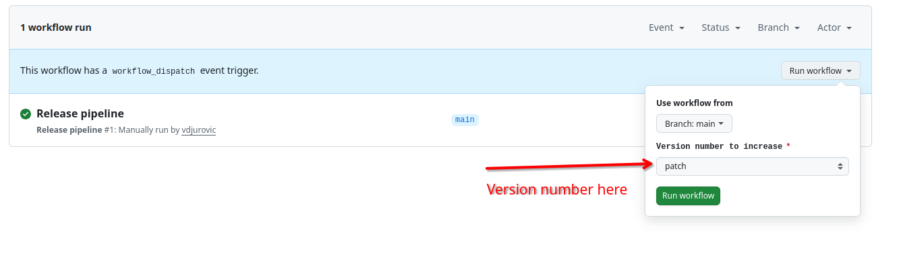

# Automatic semantic versioning for Git

## Table of Contents

- [Upgrading from version v1 to v2](#upgrading-from-version-v1-to-v2)
- [Main branch and pull request](#main-branch-and-pull-request)
- [Inputs](#inputs)
  - [`main_branch`](#main_branch)
  - [`initial_version`](#initial_version)
  - [`create_tag`](#create_tag)
  - [`tag_prefix`](#tag_prefix)
- [Output](#output)
  - [`version-string`](#version-string)
- [Usage](#usage)
- [Creating releases](#creating-releases)
- [Manual version bump](#manual-version-bump)
- [Working with multiple components in single repo](#working-with-multiple-components-in-single-repo)
- [Troubleshooting](#troubleshooting)

Github Action for automatic semantic versioning based on [Conventional Commits](https://www.conventionalcommits.org/en/v1.0.0/). In essence, the action will parse commit message to extract the context of change and bump corresponding number in semantic version string.

This action supports the following Conventional commit messages type:

* `build`, `chore`. `ci`, `docs`, `fix`, `perf`, `refactor`, `revert`, `style`, `test` - will bump micro (patch) number
* `feat` - will bump minor version number
* `BREAKING CHANGE` - will bump major version number

Action works by looking at the latest tag in the repository. It is assumed that tags are in `major.minor.patch` format, preceded by `v` (ie. valied tag would be `v1.2.3`).

In addition, it is possible to configure the action to be triggeed manually and bump specific version number. See [manual version bump](#manual-version-bump) section for details.

As an example, lets assume that latest version is `1.1.0`, represented with tag `v1.1.10`. We add a commit with the following message:

```
feat: add new awesome feature
```

This will bump version number to `1.2.0`, since `feat` marks a change in minor version.

## Upgrading from version v1 to v2

In version `v2`, some changes are made in the way semver tags are processed. Specifically, action checks tags Semantic Versioning format, and takes the latest tag
conforming to Semantic versioning as current version.

In most of the cases, upgrade should be seamless, but if you have some tags that so not conform to semver format, you might get unexpected results.

## Main branch and pull request

This action assumes that each push (merge) to the main branch will create new version of software, with corresponding semantic version. By default, main branch is assumed to be `main`, but this can be overriden in configuration. Each push to this branch will create new version.

On the other hand, if this action is used for calculating version for pull requests, the version will be short commit hash. This is convenient for testing changes in CI/CD systems.

## Inputs

### `main_branch`

Main branch for this repository. By default, it is `main`, but can be set to any other value (ie. `master`). Each push to this branch will trigger calculating new version

### `initial_version`

If this is a fresh repository with no existing tags, first version will be set to this value. By default, it is `1.0.0`

### `create_tag`

If set to `true`, create new tag with calculated version. Default value is `false`

### `tag_prefix`

If `create_tag` is enabled, this value will be used as tag prefix. Final tag name will be in format `<tag_prefix><calculated_version>`. Default value is `v`.

### `manual_bump`

If set, passes the argument to action to increase specific version number. Allowed values are:
* `major` - bump major version number
* `minor` - bump minor version number
* `patch` - bump patch version number

Default value is empty, which means that automatic versioning will be performed.

## Output

### `version-string`

Calculated semantic version string

## Usage

Simples example of using the action:

```yaml
---
on:
  push:
    branches: [main]

name: Generate SemVer Version

permissions:
  contents: read

concurrency:
  group: "${{ github.ref }}-${{ github.workflow }}"
  cancel-in-progress: true

jobs:
  versioning:
    runs-on: ubuntu-latest
    permissions:
      contents: write

    steps:
      - name: Checkout code
        uses: actions/checkout@v4
        with:
          fetch-depth: 0
          fetch-tags: true
      - name: Checkout code
        uses: actions/checkout@v3
        with:
          fetch-depth: 0
          fetch-tags: true
      - name: calculate version
        id: calculate-version
        uses: bitshifted/git-auto-semver@v2
      - name: Use version
        run: 'echo "Calculated version: ${{ steps.calculate-version.outputs.version-string }}"'

```

With customized parameters:

```yaml
---
on:
  push:
    branches: [main]

name: Generate SemVer Version

permissions:
  contents: read

concurrency:
  group: "${{ github.ref }}-${{ github.workflow }}"
  cancel-in-progress: true

jobs:
  versioning:
    permissions:
      contents: write
    runs-on: ubuntu-latest
    steps:
      - name: Checkout code
        uses: actions/checkout@v4
        with:
          fetch-depth: 0
          fetch-tags: true
      - name: Checkout code
        uses: actions/checkout@v3
        with:
          fetch-depth: 0
          fetch-tags: true
      - name: calculate version
        id: calculate-version
        uses: bitshifted/git-auto-semver@v2
        with:
          main_branch: master
          create_tag: true
          tag_prefix: 'tags'
      - name: Use version
        run: echo "Calculated version: ${{ steps.calculate-version.outputs.version-string }}"
```

## Creating releases

Although the action does not support creating releases directly, you can use it in conjunction with other actions to streamline the process of versioning, tagging and creating a release. An example workflow:

```
name: Build pipeline
on:
  pull_request:
    branches: [ main ]
  push:
    branches: [ main ]
jobs:
  build-and-test:
    runs-on: ubuntu-24.04
    # defines version output used for a release
    outputs:
      version: ${{ steps.calculate-version.outputs.version-string }}
    steps:
      - name: Checkout code
        uses: actions/checkout@v3
        with:
          fetch-depth: 0
          fetch-tags: true
      - name: Configure version information
        id: calculate-version
        if: ${{ github.event_name == 'push' }}
        uses: bitshifted/git-auto-semver@v2
        with:
          create_tag: true
          initial_version: 0.2.0
  # Create release
  create-release:
    if:  ${{ github.event_name == 'push' }}
    needs: build-and-test
    runs-on: ubuntu-24.04
    steps:
      - uses: actions/checkout@v3
        with:
          fetch-depth: 0
          fetch-tags: true
      - name: Create release
        uses: softprops/action-gh-release@v2
        with:
          draft: false
          prerelease: false
          generate_release_notes: true
          tag_name: v${{ needs.build-and-test.outputs.version }}
          token: ${{ secrets.GITHUB_TOKEN }}
```

## Manual version bump

Although the action is intended to run automatically on every push to main branch, it may not be desired in some cases. For example, you might want to release your software at some predefined intervals, or when needed.

Action can be configured to be triggered manunally, and you decide if you want to bump major, minor or patch number. When the action runs, it bump selected version number. This way, you have the best of both ways:

* automatic management of versions numbers, which means you can't have duplicate versions, skipped numbers etc.
* you can trigger the release any time you want and bump any part of the version.

The example bellow shows how to achieve this. Action will be triggered by `workflow_dispatch` event, ie. when user clicks a button in UI. This configuration also creates a dropdown box from which user can select a version number to increase, reducing the possibility for errors:

```yaml
name: Release pipeline
on:
  workflow_dispatch:
  # creates drop down for selecting version number to bump
    inputs:
      manual_bump:
        description: 'Version number to increase'
        required: true
        type: choice
        options:
          - major
          - minor
          - patch
        default: patch
jobs:
  build-and-test:
    runs-on: ubuntu-24.04
    outputs:
      version: ${{ steps.calculate-version.outputs.version-string }}
    steps:
      - name: Checkout code
        uses: actions/checkout@v3
        with:
          fetch-depth: 0
          fetch-tags: true
      - name: Configure version information
        id: calculate-version
        uses: bitshifted/git-auto-semver@v2
        with:
          create_tag: true
          initial_version: 0.2.0
          # THIS IS IMPORTANT! it will pass the required parameter to action
          manual_bump: ${{ github.event.inputs.manual_bump }}
      # add any other jobs you need
  # Create release if needed (optional)
  create-release:
    needs: build-and-test
    runs-on: ubuntu-24.04
    steps:
      - uses: actions/checkout@v3
        with:
          fetch-depth: 0
          fetch-tags: true
      - name: Download binary artifacts
        uses: actions/download-artifact@v4
        with:
          name: content-data
          path: content.tar.gz
      - name: Create release
        uses: softprops/action-gh-release@v2
        with:
          draft: false
          prerelease: false
          generate_release_notes: true
          tag_name: v${{ needs.build-and-test.outputs.version }}
          token: ${{ secrets.GITHUB_TOKEN }}
          files: |
            content.tar.gz
```

This sample also creates a release for your artifact. It will create a UI like in the image bellow:



## Working with multiple components in single repo

This section explains how you can handle cases when you have multiple components in single repository (ie. monorepo), and you want to maintain separate versions for each component. The approach assumes that your components are in separate directories.

Let's say your repository structure looks something like this:

```
my-repo
  |-- backend
  |---- backed files ...
  |-- frontend
  |---- frontend files...
```
The approach here is to configure workflow for each component (`backend` and `frontend`) to be triggered when there are changes in respective directories. For each component flow, configure `git-semver-action` to use different tag.

Example workflow for `backend` component:

```yaml
on:
  push:
    branches:
      - main
    paths:
      - 'backend/**'
  pull_request:
    branches:
      - main
    paths:
      - 'backend/**'

jobs:
  release:
    runs-on: ubuntu-24.04
    if: ${{ github.event_name == 'push' }}
    steps:
      - name: Checkout repository
        uses: actions/checkout@v4
        with:
          fetch-depth: 0
          fetch-tags: true
      - name: Calculate version
        id: calculate-version
        uses: bitshifted/git-auto-semver@v2
        with:
          create_tag: true
          initial_version: '1.0.0'
          tag_prefix: 'be-'
```

and for `frontend`

```yaml
on:
  push:
    branches:
      - main
    paths:
      - 'frontend/**'
  pull_request:
    branches:
      - main
    paths:
      - 'frontend/**'

jobs:
  release:
    runs-on: ubuntu-24.04
    if: ${{ github.event_name == 'push' }}
    steps:
      - name: Checkout repository
        uses: actions/checkout@v4
        with:
          fetch-depth: 0
          fetch-tags: true
      - name: Calculate version
        id: calculate-version
        uses: bitshifted/git-auto-semver@v2
        with:
          create_tag: true
          initial_version: '1.0.0'
          tag_prefix: 'fe-'
```

This way, when there are changes in `frontend` directory, workflow for that component will be triggered, version calculated based on tag prefix, and new tag will be created (ie. `fe-1.2.0`). The same goes for `backend` directory.

Using this approach, you can have many components in the same repo, each one maintaining separate versioning.

### Avoiding duplication

Looking at the examples above, the two workflows look mostly identical. You can extract the common code into separate workflow and call it from each workflow seaprately. This reduces dupliaction and makes maintenance easier.

Example of common workflow:

```yaml
# common.yaml

---
on:
  workflow_call:
    inputs:
      tag-prefix:
        description: 'Tag prefix to use for versioning'
        required: true
        type: string

jobs:
  release:
    runs-on: ubuntu-24.04
    if: ${{ github.event_name == 'push' }}
    steps:
      - name: Checkout repository
        uses: actions/checkout@v4
        with:
          fetch-depth: 0
          fetch-tags: true
      - name: Calculate version
        id: calculate-version
        uses: bitshifted/git-auto-semver@v2
        with:
          create_tag: true
          initial_version: '1.0.0'
          tag_prefix: '${{ inputs.tag-prefix }}'
```

To call this file from another workflow:

```yaml
# frontend.yaml
...
jobs:
  # other jobs here
  release:
    needs: test-and-verify
    uses: ./.github/workflows/common-release.yaml
    with:
      tag-prefix: 'fe-'
```

## Troubleshooting

Make sure to set `fetch-depth: 0` and `fetch-tags: true` in the checkout action. This will pull all data needed for semver to work correctly.
